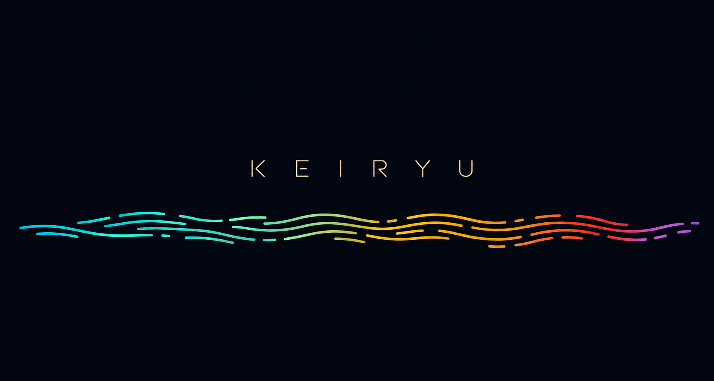
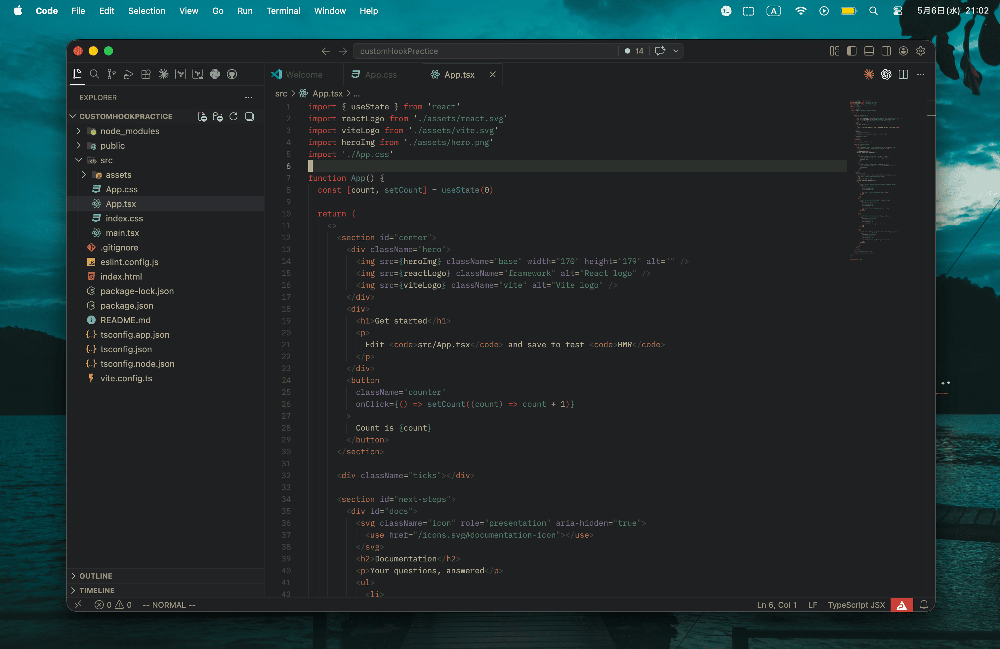
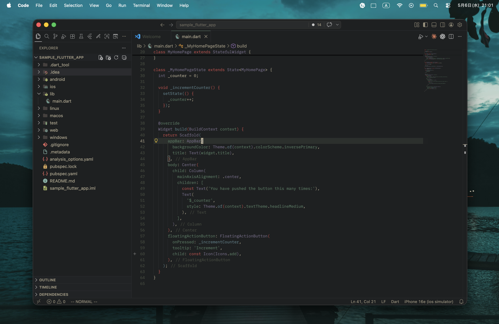

# Keiryu

**A dark VS Code theme shaped by stream, stone, moss, and late autumn light.**

Keiryu leans quiet, sharp, and atmospheric.  
Muted backgrounds hold the frame while aqua, moss, fallen maple red, and mineral purple cut through with intent.

## Preview

TypeScript / TSX

Dart

## Palette

| Name | Hex | Mood |
| --- | --- | --- |
| green / moss | `#517860` | damp stone, foliage, quiet structure |
| aqua / stream | `#587d86` | cold water, motion, function focus |
| yellow / sunlight | `#a7884a` | dry light, restrained contrast |
| orange / earth | `#a96b46` | soil, heat, muted tension |
| red / maple | `#c04848` | ember red, control flow, impact |
| purple / mineral | `#736985` | shadow, rock, type presence |

## Syntax Direction

- Functions and methods use `aqua`
- Keywords and control flow use `red`
- Types, classes, and annotations use `purple`
- JSX / TSX tag names use `orange`
- JSX / TSX attribute names use `purple`
- JSX / TSX tag brackets stay quieter with `lineNumber`
- Strings, properties, and parameters use `green`
- Numbers, booleans, and `null` stay quieter with `fgMuted`

## Languages

Keiryu is tuned first for:

- TypeScript / JavaScript
- TSX / React
- Dart
- Markdown

Markdown is also tuned with dedicated styling for:

- heading levels
- links
- inline code
- block quotes
